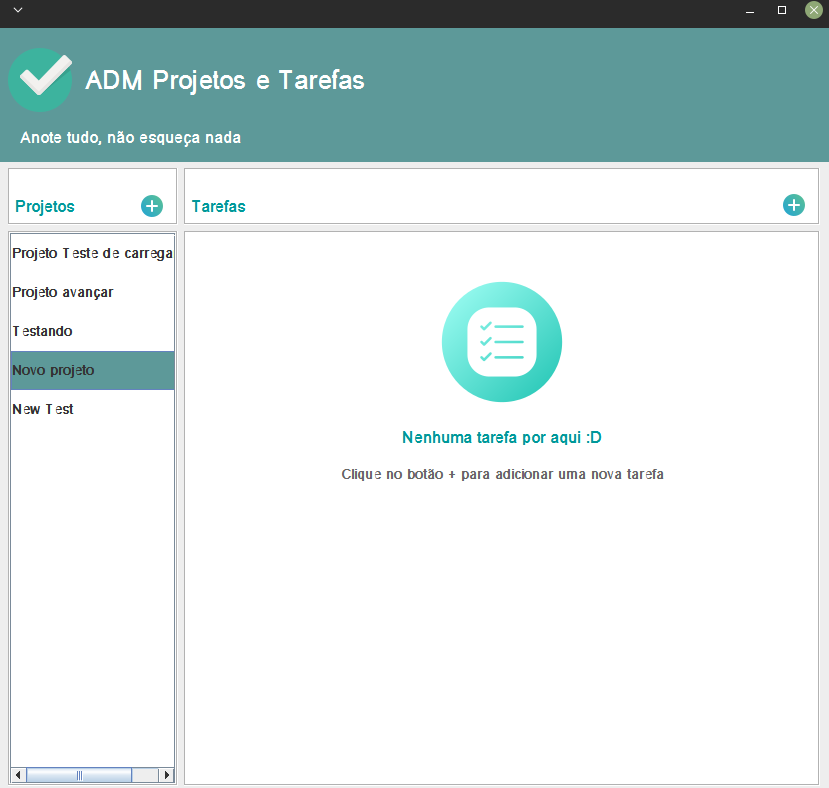
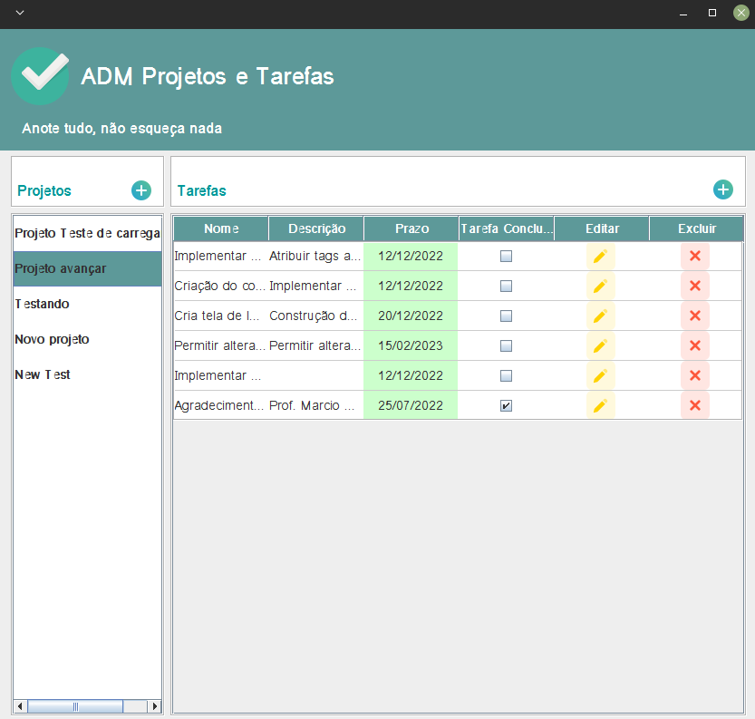

# ADM-Projetos-e-Tarefas

###### Aplicação para o gerenciamento de projetos e tarefas
##
1. INICIANDO O PROJETO

1.1. DEFINIÇÃO BÁSICA DO PROJETO

- Nome: ADM Projetos e Tarefas.

- Descrição: Aplicação para o gerenciamento de projetos e as tarefas envolvidas nesses projetos.

- Objetivo: Resolver a questão de organização de tarefas de um ou vários projetos.

1.1.1. REQUESITOS DO PROJETO

- ENTIDADES:

  Projeto
  - Atributos: nome, descrição, data de criação, data de atualização

  Tarefa
  - Atributos: nome, descrição, status, notas, data de criação, data de atualização

- REQUISITOS:

  Projetos
  - Permitir criar projetos; Permitir alterar projetos; Permitir deletar projetos

  Tarefa
  - Permitir criar tarefas; Permitir alterar tarefas; Permitir deletar tarefas

1.1.2. REGRAS DE NEGÓCIO

 - Não conterá um sistema de login
 - Não haverá o conceito de usuário
 - Toda tarefa deve pertencer a um projeto 

1.1.3. DEFINIÇÃO DAS TECNOLOGIAS UTILIZADAS

 - 
 - 

1.1.4. ETAPAS DO DESENVOLVIMENTO

- Criação do banco de dados [ok]
 - Criação das classes de modelo [ok]
 - Criação da conexão com o banco de dados [ok]
 - Criação das classes de controle (Acesso aos dados do banco [ok]
 - Criação das interfaces gráfica [ok]
   - Criação da tela principal [ok]
   - Criação do CellRederer Prazo [ok]
   - Criação do CellRederer Editar e Deletar [ok]
   - Criação da tela de Cadastro de Projeto [ok]
   - Criação da tela de Cadastro de Tarefas [ok]
 - Implementação dos eventos [ok]
  - Validações (campos de preenchimento obrigatório) [ok]
 - Ajustes finais [ok]
 - Teste da aplicação [ok]
 - Novas implementações e funcionalidades
 
 1.1.5. AGRADECIMENTOS REFERÊNCIAS
 
 - Prof. Marcio Michelluzzi 
 - ProWay
 
 1.1.6. OVERVIEWS
 
 
 
